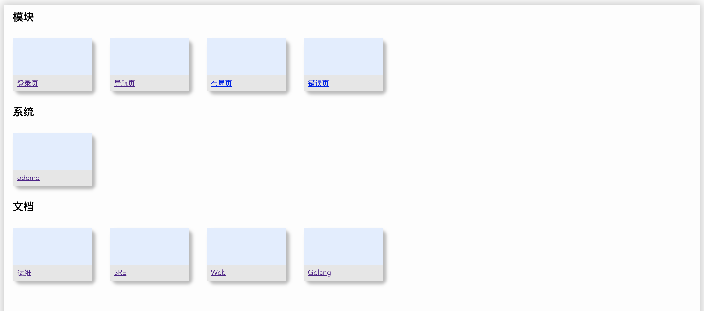
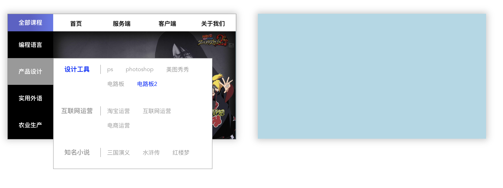

### 一：项目介绍

| 版本   | 更新日期   | 更新内容                          |
| :----- | :--------- | :-------------------------------- |
| v0.0.0 | 2021.11.03 | 项目开始                         |
| v1.0.0 | 2021.11.04 | 产品设计                         |


```
导航页:
主要由前端实现，通过列表内容去展现

数据来源：
1. 目前是写在前端 store 里的列表
2. 后期可以接入数据库数据


数据库结构：
组：id、name、info、owner
服务：id、组id、name、info、owner、链接、图标
```


### 二：前端配置

##### 1. 创建项目
```
方式一：
$ npm init vite <project-name> -- --template vue
$ cd <project-name>
$ npm install
$ npm run dev

方式二：
$ yarn create vite vue --template vue
$ cd <project-name>
$ yarn 
$ yarn dev
$ yarn add xxxx

-------------------
tips：用npm安装了elemntui一直报错，改为yarn安装
Uncaught SyntaxError: The requested module '/node_modules/.vite/vue.js?v=a53c6d6c' does not provide an export named 'createElementBlock'
```
    

#### 2. 启动
```
$ git clone https://github.com/xxxxx
$ git remote add github git@github.com:xxxxx
$ git remote add gitlab git@gitlab.com:xxxxx
$ git remote add gitee git@gitee.com:xxxxx

$ npm install -g yarn
$ cd vue
$ yarn
$ npm run dev
$ open http://127.0.0.1:8082

```


### 三：界面展示



